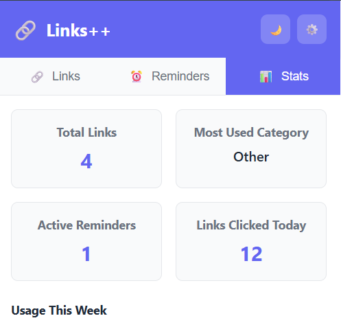
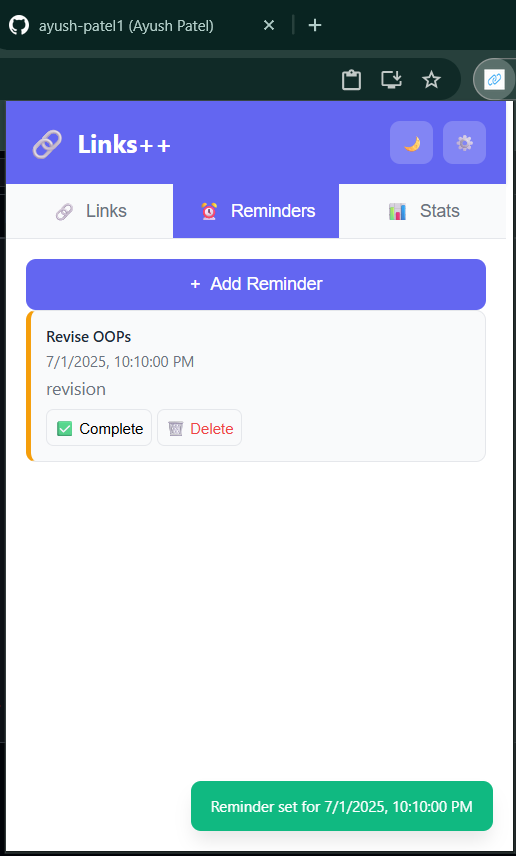
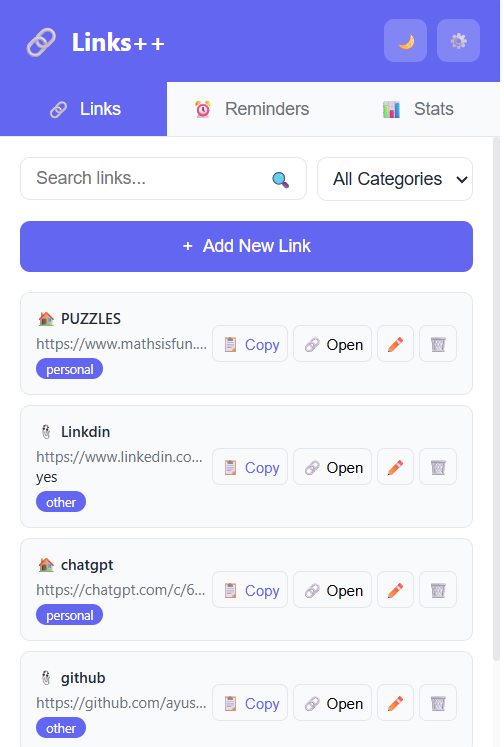

<div align="center">

# 🔗 Links Manager

### *A simple yet powerful link manager & reminder extension*

**Organize your links • Stay on top of tasks • Track your productivity**

[](https://choosealicense.com/licenses/mit/)
[](https://developer.chrome.com/docs/extensions/)
[](https://developer.mozilla.org/en-US/docs/Web/JavaScript)

---

</div>

## ✨ **Features**

<table>
<tr>
<td width="50%">

### 🔗 **Link Manager**
- 📚 Save & categorize links effortlessly
- 🔍 Smart search functionality
- 📋 One-click copy & open
- ✏️ Edit & delete with ease

</td>
<td width="50%">

### ⏰ **Smart Reminders**
- 🎯 Add task reminders
- ✅ Mark as complete
- 🗑️ Clean up when done
- 📅 Never miss important tasks

</td>
</tr>
<tr>
<td width="50%">

### 📊 **Productivity Stats**
- 📈 Total links tracked
- 🔔 Active reminders count
- 🏷️ Most used categories
- 📱 Daily & weekly usage

</td>
<td width="50%">

### 🌙 **Dark Mode**
- 🎨 Beautiful dark theme
- 👁️ Easy on the eyes
- 🌃 Perfect for late-night work
- ⚡ Instant theme switching

</td>
</tr>
</table>

---

## 📸 **Screenshots**

<div align="center">

<table>
<tr>
<td align="center" width="33%">

### 📊 **Stats Dashboard**


</td>
<td align="center" width="33%">

### ⏰ **Reminders Manager**


</td>
<td align="center" width="33%">

### 🔗 **Links Library**


</td>
</tr>
</table>

*Click images to view full size*

</div>

---

## 🚀 **Quick Installation**

> **Load Links++ as an unpacked Chrome extension in just 4 steps!**

### **Step 1:** Get the Code
```bash
# Clone the repository
git clone https://github.com/ayush-patel1/link-manager-extension.git
```
*Or [📥 download the ZIP](https://github.com/ayush-patel1/link-manager-extension/archive/refs/heads/main.zip) and extract it*

### **Step 2:** Open Chrome Extensions
- Navigate to `chrome://extensions/`
- Toggle **Developer mode** ON (top-right corner)

### **Step 3:** Load the Extension
- Click **"Load unpacked"**
- Select the folder containing `manifest.json`

### **Step 4:** You're Done! 🎉
- Links++ is now installed
- Pin it to your toolbar for quick access

---

## ⚙️ **Tech Stack**

<div align="center">

| Technology | Purpose |
|------------|---------|
|  | Structure & Layout |
|  | Styling & Animations |
|  | Core Functionality |
|  | Extension Features |

</div>

---

## 📌 **Development Roadmap**

<div align="center">

| Status | Feature | Description |
|--------|---------|-------------|
| ✅ | **Link Manager** | Save, organize, and manage links |
| ✅ | **Smart Reminders** | Task reminders with completion tracking |
| ✅ | **Stats Dashboard** | Productivity analytics and insights |
| ✅ | **Dark Mode** | Beautiful dark theme support |
| 🔄 | **Push Notifications** | Browser notifications for reminders |
| 📋 | **Custom Categories** | User-defined tags and categories |
| ☁️ | **Cloud Sync** | Backup and sync across devices |
| 📱 | **Mobile Support** | Mobile browser extension |

</div>

**Legend:** ✅ Complete • 🔄 In Progress • 📋 Planned • ☁️ Future

---

## 📂 **Project Structure**

```
📁 link-manager-extension/
├── 📁 ss/                     # Screenshots
│   ├── 🖼️ stats-dashboard.png
│   ├── 🖼️ reminders-page.png
│   └── 🖼️ links-library.png
├── 📁 icons/                  # Extension icons
├── 📄 manifest.json           # Extension manifest
├── 📄 popup.html             # Main popup interface
├── 📄 popup.js               # Core functionality
├── 📄 styles.css             # Styling & themes
└── 📄 README.md              # This file
```

---

## 🤝 **Contributing**

We welcome contributions! Here's how you can help:

1. 🍴 **Fork** the repository
2. 🌿 **Create** a feature branch (`git checkout -b feature/amazing-feature`)
3. 💾 **Commit** your changes (`git commit -m 'Add amazing feature'`)
4. 📤 **Push** to the branch (`git push origin feature/amazing-feature`)
5. 🔄 **Open** a Pull Request

---

## 🧑‍💻 **Author**

<div align="center">

### **Ayush Patel**

*Full Stack Developer & Chrome Extension Enthusiast*

[](https://github.com/ayush-patel1)
[](https://www.linkedin.com/in/ayush-patel05/)

</div>

---

## 📄 **License**

<div align="center">

This project is licensed under the **MIT License** - see the [LICENSE](LICENSE) file for details.

[](https://choosealicense.com/licenses/mit/)

*Free to use, modify, and share* 🎉

</div>

---

<div align="center">

### ⭐ **Star this repo if you found it helpful!**

**Made with ❤️ by [Ayush Patel](https://github.com/ayush-patel1)**

</div>
